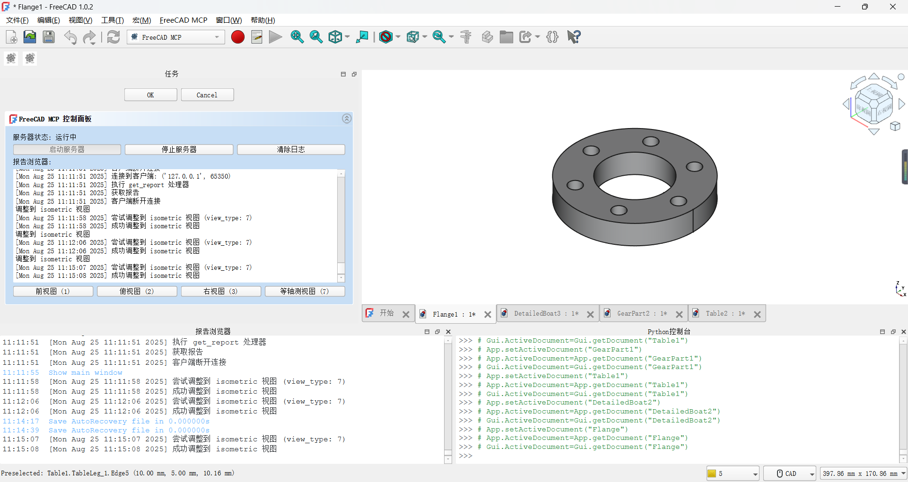
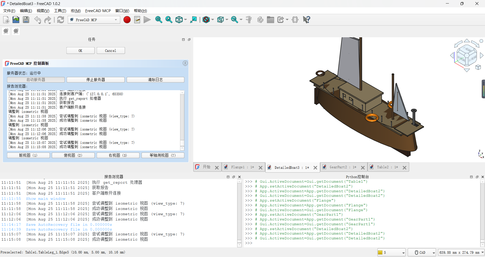
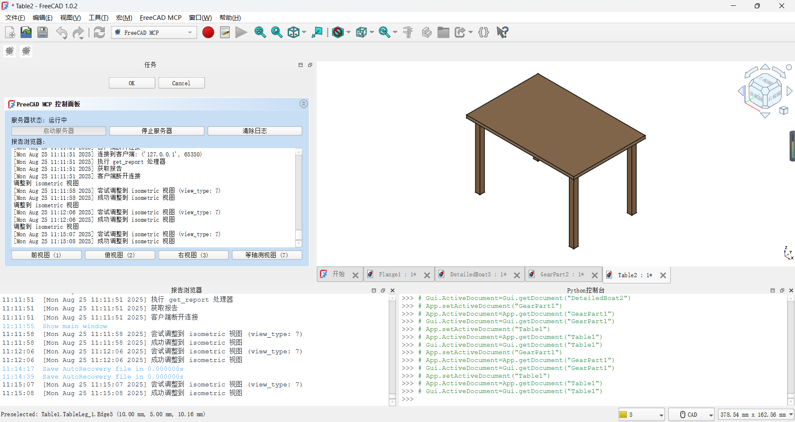

# FreeCAD MCP Plugin

The **FreeCAD MCP** plugin integrates the **Model Control Protocol (MCP)** into FreeCAD, enabling automation of model creation, macro execution, and view management through a server-client architecture. It provides a TCP server, a GUI control panel, and a client interface to streamline FreeCAD workflows, supporting tasks like running macros, adjusting views, and integrating with external tools (e.g., Claude, Cursor, Trace).


## Table of Contents

- [Features](#features)
- [Installation](#installation)
- [MCP Configuration](#mcp-configuration)
- [Usage](#usage)
- [Tool Functions](#tool-functions)
- [Use Cases](#use-cases)
- [Assets](#assets)
- [Contributing](#contributing)
- [License](#license)

## Features

The FreeCAD MCP plugin (v0.1.0) offers:

- **TCP Server**: Runs on `localhost:9876`, handling commands like `get_scene_info`, `run_script`, `run_macro`, `set_view`, and `get_report` (`freecad_mcp_server.py`).
- **GUI Control Panel**: Provides buttons to start/stop the server, clear logs, and switch views (front, top, right, axonometric) (`freecad_mcp_server.py`).
- **Client Interface**: Command-line tool to run `.FCMacro` files, validate code, and control FreeCAD remotely (`freecad_mcp_client.py`).
- **Macro Normalization**: Automatically adds imports (`FreeCAD`, `Part`, `math`) and post-execution steps (recompute, view adjustment) (`freecad_mcp_client.py`).
- **Logging**: Records messages and errors to `freecad_mcp_log.txt` and a GUI report browser (100-line limit).
- **Workbench Integration**: Adds a `FreeCADMCPWorkbench` with toolbar/menu commands (`InitGui.py`).
- **Visual Assets**: Includes workbench icon (`icon.svg`) and example models (`gear.png`, `flange.png`, `boat.png`, `table.png`).

Watch the demo video: [FreeCAD MCP Demo](https://github.com/ATOI-Ming/FreeCADMCP/releases/download/v0.1.0/freecad.mp4)

## Installation

Follow these steps to install and set up the FreeCAD MCP plugin.

### Prerequisites

- **FreeCAD**: Version 0.21 or later. [Download FreeCAD](https://www.freecadweb.org/downloads.php).
- **Python**: Version 3.8+ (included with FreeCAD or via Anaconda).
- **Anaconda** (optional, for dependency management): [Download Anaconda](https://www.anaconda.com/products/distribution).
- **Dependencies**: `mcp-server>=1.2.0`, `httpx>=0.24.1` (specified in `pyproject.toml`).

### Installation Steps

1. **Clone the Repository**:

   ```bash
   git clone https://github.com/ATOI-Ming/FreeCADMCP.git
   ```

2. **Copy to FreeCAD Mod Directory**:

   Move the `FreeCADMCP` folder to FreeCAD's Mod directory:

   - **Windows**: `C:\Users\<YourUser>\AppData\Roaming\FreeCAD\Mod\`
   - **Linux**: `~/.local/share/FreeCAD/Mod/`
   - **macOS**: `~/Library/Application Support/FreeCAD/Mod/`

   ```bash
   cp -r FreeCADMCP C:\Users\<YourUser>\AppData\Roaming\FreeCAD\Mod\
   ```

3. **Set Up Anaconda Environment** (recommended):

   Create and activate a new Anaconda environment:

   ```bash
   conda create -n freecad_mcp python=3.8
   conda activate freecad_mcp
   ```

   Install dependencies:

   ```bash
   pip install mcp-server>=1.2.0 httpx>=0.24.1
   ```

4. **Launch FreeCAD**:

   - Open FreeCAD.
   - Switch to the `FreeCADMCPWorkbench` (icon: `assets/icon.svg`) from the workbench dropdown.

5. **Verify Installation**:

   - Confirm the `FreeCADMCPWorkbench` appears in FreeCAD.
   - Click `FreeCAD_MCP_Show` to open the control panel or `FreeCAD_MCP_RunMacro` to test macro execution.

## MCP Configuration

Configure the MCP server to run `freecad_mcp_server.py` using FreeCAD's Python or Anaconda.

1. **Create Configuration File**:

   Create a JSON file (e.g., `mcp_config.json`) in `D:\FreeCAD\Mod\FreeCADMCP\`:

   ```json
   {
       "mcpServers": {
           "freecad": {
               "command": "C:\\ProgramData\\anaconda3\\python.exe",
               "args": ["D:\\FreeCAD\\Mod\\FreeCADMCP\\freecad_mcp_server.py"]
           }
       }
   }
   ```

   **Notes**:
   - Adjust paths for your system:
     - Linux: `/home/<user>/anaconda3/bin/python`, `/home/<user>/.local/share/FreeCAD/Mod/FreeCADMCP/freecad_mcp_server.py`
     - macOS: `/Users/<user>/anaconda3/bin/python`, `/Users/<user>/Library/Application Support/FreeCAD/Mod/FreeCADMCP/freecad_mcp_server.py`
   - The configuration uses `freecad_mcp_server.py` (corrected from `freecad_bridge.py`).

2. **Run the Server**:

   - **GUI Method**: In `FreeCADMCPWorkbench`, click `FreeCAD_MCP_Show` and press the "Start Server" button.
   - **Command-Line Method**:
     ```bash
     conda activate freecad_mcp
     python D:\FreeCAD\Mod\FreeCADMCP\freecad_mcp_server.py
     ```

3. **Verify Server**:

   - Check `freecad_mcp_log.txt` in `D:\FreeCAD\Mod\FreeCADMCP\` for startup messages (e.g., "Server started on localhost:9876").
   - Ensure the server is listening on `localhost:9876`.

## Usage

### Using the GUI Control Panel

1. In FreeCAD, switch to `FreeCADMCPWorkbench` (icon: `assets/icon.svg`).
2. Click `FreeCAD_MCP_Show` to open the control panel (`FreeCADMCPPanel`).
3. Use the panel:
   - **Start/Stop Server**: Starts or stops the TCP server (`localhost:9876`).
   - **Clear Logs**: Clears the report browser and `freecad_mcp_log.txt`.
   - **View Buttons**: Switches to front, top, right, or axonometric view.
4. Monitor logs in the report browser (updated every second via `QTimer`).

### Running Macros

1. **GUI Method**:
   - In `FreeCADMCPWorkbench`, click `FreeCAD_MCP_RunMacro`.
   - Select a `.FCMacro` file using the file dialog.
   - The macro runs with automatic normalization (adds imports, recomputes document, adjusts view).

2. **Command-Line Method**:
   - Activate Anaconda environment:
     ```bash
     conda activate freecad_mcp
     ```
   - Run a macro:
     ```bash
     python D:\FreeCAD\Mod\FreeCADMCP\freecad_mcp_client.py --run-macro path/to/macro.FCMacro
     ```
   - With parameters:
     ```bash
     python D:\FreeCAD\Mod\FreeCADMCP\freecad_mcp_client.py --run-macro gear.FCMacro --params '{"radius": 10}'
     ```

### Remote Control

Use `freecad_mcp_client.py` to send commands to the server:

```bash
python D:\FreeCAD\Mod\FreeCADMCP\freecad_mcp_client.py --set-view front
python D:\FreeCAD\Mod\FreeCADMCP\freecad_mcp_client.py --get-report
```

## Tool Functions

The plugin provides the following tool functions, defined in `freecad_mcp_client.py` and handled by `freecad_mcp_server.py`:

- **get_scene_info**:
  - **Description**: Retrieves details of the active FreeCAD document (e.g., object names, types, properties).
  - **Usage**: 
    ```bash
    python freecad_mcp_client.py --get-scene-info
    ```
  - **Output**: JSON with document details.
  - **Code**: `freecad_mcp_server.py` (`handle_get_scene_info`).

- **run_script**:
  - **Description**: Executes a Python script in FreeCAD's Python environment.
  - **Usage**: 
    ```bash
    python freecad_mcp_client.py --run-script script.py
    ```
  - **Code**: `freecad_mcp_server.py` (`handle_run_script`).

- **run_macro**:
  - **Description**: Runs a `.FCMacro` file with optional parameters, normalizing code (adds `FreeCAD`, `Part`, `math` imports, recomputes document, sets axonometric view).
  - **Usage**: 
    ```bash
    python freecad_mcp_client.py --run-macro macro.FCMacro --params '{"radius": 10}'
    ```
  - **Code**: `freecad_mcp_client.py` (`normalize_macro_code`), `freecad_mcp_server.py` (`handle_run_macro`).

- **set_view**:
  - **Description**: Adjusts the FreeCAD view to front, top, right, or axonometric.
  - **Usage**: 
    ```bash
    python freecad_mcp_client.py --set-view axonometric
    ```
  - **Code**: `freecad_mcp_server.py` (`handle_set_view`).

- **get_report**:
  - **Description**: Retrieves the latest logs from `freecad_mcp_log.txt`.
  - **Usage**: 
    ```bash
    python freecad_mcp_client.py --get-report
    ```
  - **Code**: `freecad_mcp_server.py` (`handle_get_report`).

- **validate_macro_code**:
  - **Description**: Validates `.FCMacro` code before execution.
  - **Usage**: 
    ```bash
    python freecad_mcp_client.py --validate-macro-code macro.FCMacro
    ```
  - **Code**: `freecad_mcp_client.py` (`validate_macro_code`).

## Use Cases

### 1. Automating Gear Model Creation

- **Scenario**: Create a gear model programmatically for engineering design.
- **Steps**:
  1. Write a `.FCMacro` file (`gear.FCMacro`):
     ```python
     import FreeCAD, Part
     radius = 10  # Adjustable via --params
     gear = Part.makeCylinder(radius, 5)
     Part.show(gear)
     ```
  2. Run via client:
     ```bash
     python freecad_mcp_client.py --run-macro gear.FCMacro --params '{"radius": 15}'
     ```
  3. Result: Gear model created, recomputed, and displayed in axonometric view.
- **Output**: 
  

### 2. Generating a Flange Model

- **Scenario**: Automate flange creation with holes for mechanical design.
- **Steps**:
  1. Use a macro (`flange.FCMacro`) to create a flange.
  2. Run via GUI (`FreeCAD_MCP_RunMacro`) or command line:
     ```bash
     python freecad_mcp_client.py --run-macro flange.FCMacro
     ```
  3. Result: Flange model created with normalized code.
- **Output**: 
  

### 3. Text-Based Model Generation

- **Scenario**: Generate a boat model from a text description (e.g., "create a boat with a curved hull").
- **Steps**:
  1. Use an external tool (e.g., Claude) to generate `boat.FCMacro` from the description.
  2. Run the macro:
     ```bash
     python freecad_mcp_client.py --run-macro boat.FCMacro
     ```
  3. Result: Boat model created with automatic imports and view adjustment.
- **Output**: 
  

### 4. CAD Drawing Recognition

- **Scenario**: Recreate a table model from a CAD drawing.
- **Steps**:
  1. Convert CAD drawing to `table.FCMacro` using a tool like Trace.
  2. Run via GUI or command line:
     ```bash
     python freecad_mcp_client.py --run-macro table.FCMacro
     ```
  3. Result: Table model recreated in FreeCAD.
- **Output**: 
  

### 5. Batch Processing Models

- **Scenario**: Automate creation of multiple models (e.g., gear and flange).
- **Steps**:
  1. Create a script to loop through macros:
     ```bash
     for macro in gear.FCMacro flange.FCMacro; do
         python freecad_mcp_client.py --run-macro $macro
     done
     ```
  2. Result: Models generated sequentially, logged in `freecad_mcp_log.txt`.

## Assets

The `assets/` directory contains visual and demonstration resources for the FreeCAD MCP plugin:

- **icon.svg**: Workbench and command icon for `FreeCADMCPWorkbench`, used in `InitGui.py` and `package.xml`.
  
- **gear.png**: Example gear model created via `run_macro`.
  
- **flange.png**: Example flange model for engineering design.
  
- **boat.png**: Example boat model from text-based generation.
  
- **table.png**: Example table model from CAD drawing recognition.
  
- **freecad.mp4**: Demo video showcasing GUI panel, macro execution, and view switching.
  Watch: [FreeCAD MCP Demo](https://github.com/ATOI-Ming/FreeCADMCP/releases/download/v0.1.0/freecad.mp4)

## Contributing

Contributions are welcome! To contribute:

1. Fork the repository: `https://github.com/ATOI-Ming/FreeCADMCP`.
2. Create a branch: `git checkout -b feature/your-feature`.
3. Commit changes: `git commit -m "Add your feature"`.
4. Push and create a Pull Request.

Please follow the [Code of Conduct](CODE_OF_CONDUCT.md) (to be added).

## License

This project is licensed under the MIT License. See [LICENSE](LICENSE) for details.