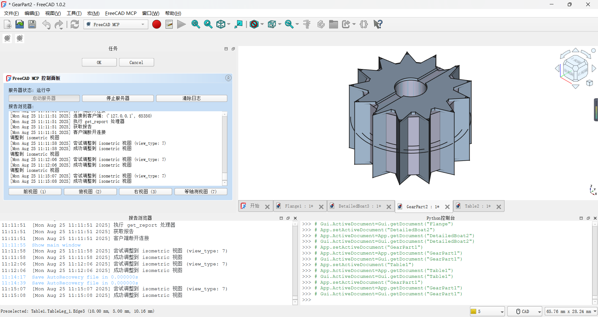

# FreeCAD MCP Plugin

The **FreeCAD MCP** plugin integrates the **Model Control Protocol (MCP)** into FreeCAD, enabling automation of model creation, macro execution, and view management through a server-client architecture. It provides a GUI control panel and a command-line client to streamline FreeCAD workflows, supporting tasks like creating/running macros, adjusting views, and integrating with external tools (e.g., Claude, Cursor, Trace, CodeBuddy).


## Table of Contents

- [Features](#features)
- [Quick Start](#quick-start)
- [Installation](#installation)
- [MCP Configuration](#mcp-configuration)
- [Usage](#usage)
- [Tool Functions](#tool-functions)
- [Use Cases](#use-cases)
- [External Tool Integration](#external-tool-integration)
- [Assets](#assets)
- [Troubleshooting](#troubleshooting)
- [Contributing](#contributing)
- [License](#license)

## Features

The FreeCAD MCP plugin (v0.1.0) offers the following features:

- **MCP Server**: Provides a GUI control panel (`FreeCADMCPPanel`) and processes commands like `create_macro`, `update_macro`, `run_macro`, `set_view`, and `get_report` (implemented in `freecad_mcp_server.py`).
- **MCP Client**: Command-line tool to send commands via `stdio` or TCP, manage `.FCMacro` files (create, update, run, validate), and control FreeCAD remotely (implemented in `freecad_mcp_client.py`).
- **Macro Normalization**: Automatically adds imports (`FreeCAD`, `FreeCADGui`, `Part`, `math`) and post-execution steps (recompute, view adjustment) for macros.
- **GUI Control Panel**: Includes buttons to start/stop the server, clear logs, and switch views (front, top, right, axonometric).
- **Logging System**: Records messages and errors to `freecad_mcp_log.txt` in the temporary directory (e.g., `%TEMP%\freecad_mcp_log.txt`) and a GUI report browser (100-line limit).
- **Workbench Integration**: Adds a `FreeCADMCPWorkbench` with toolbar and menu commands (implemented in `InitGui.py`).
- **Visual Assets**: Includes workbench icon (`icon.svg`), example models (`gear.png`, `flange.png`, `boat.png`, `table.png`), and demo animation (`freecad.gif`, `freecad.mp4`).

Watch the demo animation:

Download the demo video: [FreeCAD MCP Demo MP4](assets/freecad.mp4)

## Quick Start

1. Install the plugin (see [Installation](#installation)).
2. Launch FreeCAD and switch to the `FreeCAD MCP` workbench.
3. Open the control panel (`FreeCAD_MCP_Show`) and click "Start Server."
4. Run an example macro:
   ```bash
   python D:\FreeCAD\Mod\FreeCAD-MCP-main\src\freecad_mcp_client.py --run-macro gear.FCMacro --params '{"radius": 15}'
   ```
5. View the result: A gear model is generated and displayed in axonometric view.

## Installation

### Prerequisites

- **FreeCAD**: Version 0.21 or higher, [Download FreeCAD](https://www.freecad.org/download). Select the version for your operating system.
- **Python**: Version 3.8+ (included with FreeCAD or installed via Anaconda).
- **Anaconda** (recommended for dependency management): [Download Anaconda](https://www.anaconda.com/download). Select the version for your operating system.
- **Python Dependencies**:
  - Required packages: `mcp-server>=1.2.0`, `httpx>=0.24.1` (specified in `pyproject.toml`).
  - Installation commands:
    ```bash
    # Create and activate Anaconda environment
    conda create -n freecad_mcp python=3.8
    conda activate freecad_mcp
    pip install mcp-server>=1.2.0 httpx>=0.24.1
    # Or use system Python
    python -m pip install mcp-server>=1.2.0 httpx>=0.24.1
    ```
  - Verify installation:
    ```bash
    pip show mcp-server httpx
    ```
    Ensure `mcp-server` version is >=1.2.0 and `httpx` version is >=0.24.1.

### Installation Steps

1. **Clone the Repository**:
   ```bash
   git clone https://github.com/ATOI-Ming/FreeCAD-MCP.git
   ```

2. **Copy to FreeCAD Mod Directory**:
   Copy the `FreeCAD-MCP` folder to:
   - Windows: `D:\FreeCAD\Mod\FreeCAD-MCP`
   - Linux: `~/.local/share/FreeCAD/Mod/FreeCAD-MCP`
   - macOS: `~/Library/Application Support/FreeCAD/Mod/FreeCAD-MCP`
   ```bash
   # Windows example
   xcopy FreeCAD-MCP D:\FreeCAD\Mod\FreeCAD-MCP /E /H /C /I
   ```
   **Note**: Adjust `D:\FreeCAD\Mod` based on your FreeCAD installation path.

3. **Launch FreeCAD**:
   - Open FreeCAD and switch to the `FreeCAD MCP` workbench (icon: `assets/icon.svg`).
   - Verify that `FreeCAD-MCP` is loaded in **Edit > Preferences > Add-ons**.

4. **Verify Installation**:
   - Click `FreeCAD_MCP_Show` to open the control panel.
   - Check the temporary directory (e.g., `%TEMP%\freecad_mcp_log.txt`) for startup messages.

## MCP Configuration

Configure the MCP client to communicate with FreeCAD via `stdio` or TCP.

1. **Create Configuration File**:
   Create `mcp_config.json` in `D:\FreeCAD\Mod\FreeCAD-MCP-main\src\`:
   ```json
   {
       "mcpServers": {
           "freecad": {
               "disabled": false,
               "timeout": 60,
               "type": "stdio",
               "command": "D:\\Anaconda3\\python.exe",
               "args": ["D:\\FreeCAD\\Mod\\FreeCAD-MCP-main\\src\\freecad_mcp_client.py"]
           }
       }
   }
   ```
   **Note**:
   - Adjust paths based on your system:
     - **Anaconda Path**: e.g., `C:\Anaconda3\python.exe` (Windows), `/home/<user>/anaconda3/bin/python` (Linux), `/Users/<user>/anaconda3/bin/python` (macOS).
     - **FreeCAD Mod Path**: e.g., `C:\Users\<YourUser>\AppData\Roaming\FreeCAD\Mod\FreeCAD-MCP` (Windows), `/home/<user>/.local/share/FreeCAD/Mod/FreeCAD-MCP` (Linux), `/Users/<user>/Library/Application Support/FreeCAD/Mod/FreeCAD-MCP` (macOS).
   - For TCP communication, set `"type": "tcp"`, add `"host": "localhost"`, and `"port": 9876`.

2. **Run the Server**:
   - **GUI Method**: In the `FreeCAD MCP` workbench, click `FreeCAD_MCP_Show` and then "Start Server."
   - **Command-Line Method**:
     ```bash
     conda activate freecad_mcp
     python D:\FreeCAD\Mod\FreeCAD-MCP-main\src\freecad_mcp_server.py
     ```

3. **Verify Server**:
   - Check `%TEMP%\freecad_mcp_log.txt` for a "Server started" message.
   - Test a client command:
     ```bash
     python D:\FreeCAD\Mod\FreeCAD-MCP-main\src\freecad_mcp_client.py --get-report
     ```

## Usage

### GUI Usage

1. In FreeCAD, switch to the `FreeCAD MCP` workbench (icon: `assets/icon.svg`).
2. Click `FreeCAD_MCP_Show` to open the control panel (`FreeCADMCPPanel`).
3. Use the control panel:
   - **Start/Stop Server**: Control the MCP server.
   - **Clear Logs**: Clear the report browser and `%TEMP%\freecad_mcp_log.txt`.
   - **View Switching**: Select front, top, right, or axonometric views.
4. Run a macro:
   - Click `FreeCAD_MCP_RunMacro`, select an `.FCMacro` file, and execute it with automatic normalization.

### Command-Line Usage

1. Activate the Anaconda environment:
   ```bash
   conda activate freecad_mcp
   ```
2. Run client commands:
   ```bash
   python D:\FreeCAD\Mod\FreeCAD-MCP-main\src\freecad_mcp_client.py <command>
   ```
   Examples:
   - Create macro: `--create-macro my_macro --template-type part`
   - Run macro: `--run-macro my_macro.FCMacro --params '{"radius": 10}'`
   - Set view: `--set-view '{"view_type": "7"}'`
   - Get report: `--get-report`

## Tool Functions

The following tool functions are provided by `freecad_mcp_client.py`, sending commands via `stdio` or TCP (`localhost:9876`), processed by `freecad_mcp_server.py`.

| Function              | Parameters                              | Description                                                          |
|-----------------------|-----------------------------------------|----------------------------------------------------------------------|
| `create_macro`        | `macro_name`, `template_type`           | Creates an `.FCMacro` file, validates name (letters, numbers, underscores, hyphens), supports templates (`default`, `basic`, `part`, `sketch`). |
| `update_macro`        | `macro_name`, `code`                    | Updates macro content, auto-adds `FreeCAD`, `FreeCADGui`, `Part`, `math` imports. |
| `run_macro`           | `macro_path`, `params` (optional)       | Runs a macro, normalizes code, recomputes document, adjusts to axonometric view. |
| `validate_macro_code` | `macro_name` (optional), `code` (optional) | Validates macro code syntax, returns success or error (with traceback). |
| `set_view`            | `params` (e.g., `{"view_type": "7"}`)  | Sets view: `1` (front), `2` (top), `3` (right), `7` (axonometric).   |
| `get_report`          | None                                    | Retrieves server logs (from `%TEMP%\freecad_mcp_log.txt` and report browser). |

### Examples

- **Create Macro**:
  ```bash
  python D:\FreeCAD\Mod\FreeCAD-MCP-main\src\freecad_mcp_client.py --create-macro gear --template-type part
  ```
  Output: `{"status": "success", "result": "Macro created"}`

- **Update Macro**:
  ```bash
  python D:\FreeCAD\Mod\FreeCAD-MCP-main\src\freecad_mcp_client.py --update-macro gear --code "import FreeCAD, Part\nradius = 10\ngear = Part.makeCylinder(radius, 5)\nPart.show(gear)"
  ```
  Output: `{"status": "success", "result": "Macro updated"}`

- **Run Macro**:
  ```bash
  python D:\FreeCAD\Mod\FreeCAD-MCP-main\src\freecad_mcp_client.py --run-macro gear.FCMacro --params '{"radius": 15}'
  ```
  Output: `{"status": "success", "result": {...}}`

- **Validate Code**:
  ```bash
  python D:\FreeCAD\Mod\FreeCAD-MCP-main\src\freecad_mcp_client.py --validate-macro-code gear --code "import FreeCAD\nApp.newDocument()"
  ```
  Output: `{"status": "success"}`

- **Set View**:
  ```bash
  python D:\FreeCAD\Mod\FreeCAD-MCP-main\src\freecad_mcp_client.py --set-view '{"view_type": "7"}'
  ```
  Output: `{"status": "success", "result": "view set to axonometric"}`

- **Get Report**:
  ```bash
  python D:\FreeCAD\Mod\FreeCAD-MCP-main\src\freecad_mcp_client.py --get-report
  ```
  Output: `{"status": "success", "result": {...}}`

## Use Cases

1. **Automated Gear Model Creation**:
   - **Scenario**: Generate a parametric gear model for engineering design.
   - **Steps**:
     1. Create macro: `--create-macro gear --template-type part`
     2. Update macro: `--update-macro gear --code "import FreeCAD, Part\nradius = 15\ngear = Part.makeCylinder(radius, 5)\nPart.show(gear)"`
     3. Run macro: `--run-macro gear.FCMacro --params '{"radius": 15}'`
   - **Result**: Gear model generated, displayed in axonometric view.
   - **Output**:
     

2. **Generating a Flange Model**:
   - **Scenario**: Automate creation of a flange with holes for mechanical design.
   - **Steps**: Run macro: `--run-macro flange.FCMacro`
   - **Result**: Flange model generated with automatic normalization.
   - **Output**:
     

3. **Text-Based Model Generation**:
   - **Scenario**: Generate a boat model from a text description (e.g., "create a boat with a curved hull").
   - **Steps**:
     1. Use Claude to generate `boat.FCMacro`.
     2. Run macro: `--run-macro boat.FCMacro`
   - **Result**: Boat model generated with automatic view adjustment.
   - **Output**:
     

4. **CAD Drawing Recognition**:
   - **Scenario**: Recreate a table model from a CAD drawing.
   - **Steps**:
     1. Use Trace to convert drawing to `table.FCMacro`.
     2. Run macro: `--run-macro table.FCMacro`
   - **Result**: Table model generated.
   - **Output**:
     

5. **Batch Processing Models**:
   - **Scenario**: Automate creation of multiple models (e.g., gear and flange).
   - **Steps**:
     ```bash
     for macro in gear.FCMacro flange.FCMacro; do
         python D:\FreeCAD\Mod\FreeCAD-MCP-main\src\freecad_mcp_client.py --run-macro $macro
     done
     ```
   - **Result**: Models generated sequentially, logged to `%TEMP%\freecad_mcp_log.txt`.
   - **Output**: See `gear.png` and `flange.png`.

## External Tool Integration

FreeCAD MCP supports integration with external tools to enhance model generation:

- **Claude**: AI model for generating `.FCMacro` files from text descriptions.
  - **Example**: Input "create a gear with 10mm radius," generates:
    ```python
    import FreeCAD, Part
    radius = 10
    gear = Part.makeCylinder(radius, 5)
    Part.show(gear)
    ```
    Save as `gear.FCMacro`, run: `--run-macro gear.FCMacro`.
- **Trace**: CAD drawing processing tool to convert drawings to `.FCMacro` files.
  - **Example**: Convert a table drawing to `table.FCMacro`, run: `--run-macro table.FCMacro`.
- **Cursor/CodeBuddy**: Code editing tools for writing and debugging macro code.
  - **Example**: Edit `flange.FCMacro` in Cursor, update: `--update-macro flange.FCMacro --code "<code>"`.

## Assets

The `assets/` directory contains the following resources:

- **icon.svg**: Icon for `FreeCADMCPWorkbench`, used in `InitGui.py` and `package.xml`.
  
- **gear.png**: Example gear model.
  
- **flange.png**: Example flange model.
  
- **boat.png**: Example boat model.
  
- **table.png**: Example table model.
  
- **freecad.gif**: Demo animation showing GUI panel, macro execution, and view switching.
  
- **freecad.mp4**: Demo video, available for download.
  Download: [FreeCAD MCP Demo MP4](assets/freecad.mp4)

## Troubleshooting

- **Server Fails to Start**:
  - **Issue**: Port 9876 is in use.
  - **Solution**: Check port (`netstat -ano | findstr 9876`), change port, or terminate conflicting process.
- **Client Connection Failure**:
  - **Issue**: Incorrect paths in `mcp_config.json`.
  - **Solution**: Verify `command` and `args` paths, e.g., `D:\Anaconda3\python.exe` and `D:\FreeCAD\Mod\FreeCAD-MCP-main\src\freecad_mcp_client.py`.
- **Macro Execution Errors**:
  - **Issue**: Syntax errors or missing imports in macro code.
  - **Solution**: Use `--validate-macro-code` to check code, review traceback in `%TEMP%\freecad_mcp_log.txt`.
- **Log File Not Generated**:
  - **Issue**: No write permission in temporary directory.
  - **Solution**: Check permissions for `%TEMP%\freecad_mcp_log.txt`, or specify another path in `freecad_mcp_server.py`.
- **More Help**: Submit issues on GitHub ([Bug Tracker](https://github.com/ATOI-Ming/FreeCAD-MCP/issues)).

## Contributing

Contributions are welcome! Follow these steps:

1. Fork the repository: `https://github.com/ATOI-Ming/FreeCAD-MCP`.
2. Create a branch: `git checkout -b feature/your-feature`.
3. Commit changes: `git commit -m "Add your feature"`.
4. Push and create a Pull Request.

Please adhere to the Code of Conduct (to be added, see [CODE_OF_CONDUCT.md](CODE_OF_CONDUCT.md)).

## License

This project is licensed under the MIT License. See [LICENSE](LICENSE) for details.